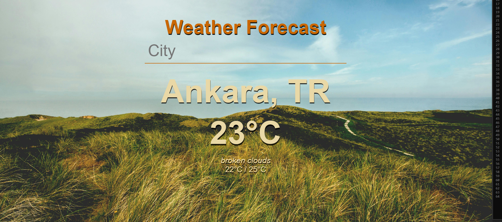

# Weather Forecast Application

This is a simple Weather Forecast application built using [insert programming languages and frameworks/libraries used, e.g., Python, Flask, React, etc.]. It fetches weather data from a weather API and displays the forecast for a given location.

## Features

- Current weather information
- User-friendly interface
- Responsive design

## Technologies Used

- Node.js
- Express.js
- HTML
- CSS
- OpenWeatherMap API

## Installation

1. Clone the repository:
    ```sh
    git clone https://github.com/ZeynepDilanKilic/Weather-Forecast.git
    ```
2. Navigate to the project directory:
    ```sh
    cd Weather-Forecast
    ```
3. Install the required dependencies:
    ```sh
    npm install
    ```

## Usage

1. Obtain an API key from [OpenWeatherMap](https://openweathermap.org/api).
2. Create a `.env` file in the root directory and add your API key:
    ```sh
    API_KEY=your_api_key_here
    ```
3. Start the application:
    ```sh
    node server.js
    ```
4. Open your browser and navigate to `http://localhost:3000` to view the application.

## Screenshots



## Contributing

1. Fork the repository.
2. Create your feature branch (`git checkout -b feature/YourFeature`).
3. Commit your changes (`git commit -m 'Add some feature'`).
4. Push to the branch (`git push origin feature/YourFeature`).
5. Open a pull request.

## License

This project is licensed under the MIT License - see the [LICENSE](LICENSE) file for details.

## Acknowledgments

- Thanks to [OpenWeatherMap](https://openweathermap.org) for providing the weather data API.


